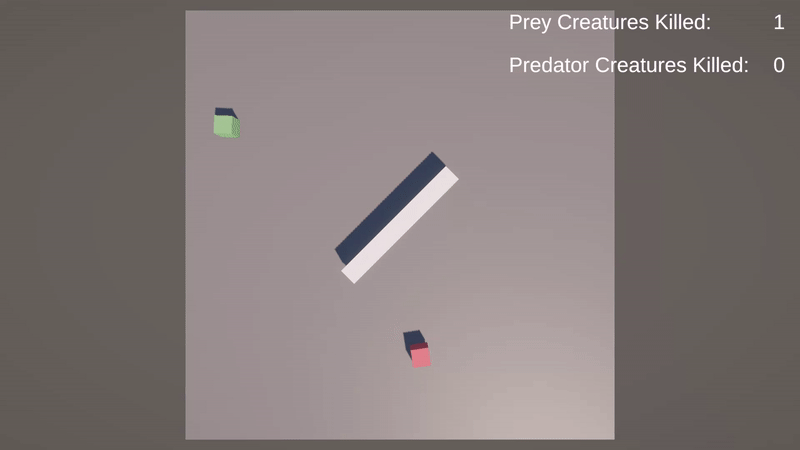

# TestProj_Zoo
Simple unity project for Unity 6000.0.26f1. Made by Roman Rybin

## Description
Simple 3D Game: Prey/Predator Creatures appear on scene. Via food chain logic, the eat each other. No input from player required
## Plugins
### Used ones
- Zenject
- DoTween (was used at some point, changed to Coroutines at the `Scripts/Visual/Effects/Signgle Effects/OnKillEffect.cs`)
## Code Description
### Entry point
- Main logic aligns with MVC pattern, so all controlls are made from `Scripts/Controllers/CreaturesManager.cs`  
- I also use Zenject: effects and statistics are managed through SignalBus (all signals & binds are managed through `Scripts/Controllers/ZenjectBinder.cs`). Also tried to loosen hard dependencies through Zenject fabrics.  
- To keep the code separated with some logic, I use *Core* namespace for all Core-Related scripts. Core has Sub-Namespaces: *Core.Effects* and *Core.UI*
### Creature Logic
Main Creature script is located at `Scripts/Models/Creature.cs` - and contains of:  
1. Init function: called from `CreaturesFactory`
2. Current `IState` - main logic is divided with the "State" pattern. For more, look at [States](#states)
3. Actions for Collision, TriggerCollision and Actions. First two are called by MonoBehaviour logic, as where the "OnAction" is called from `public void CallEvent(EventTypes Event)`. It's made for local use (and doesn't apply anywhere) - but this method also calles the Zenject.SignalBus for global use. For more info on actions, read the [Actions](#actions)
### States
All states are located at `Scripts/Model/States`
1. *StateChoosingNewPath* - main logic entry: for rotating Creature object with the chosen path.
2. *StateMoving* - for moving via chosen `IMovementStrategy`.
3. *StateFighting* is called from Moving, when collision with another Creature occurs, choosing creature's involvment in fighting with the help of a `IFightingStrategy` (For more - look at [Fighting Section](#fighting))
4. *StateKilling*, *StateDying* and *StateChoosingNewPath* comes after fighting, depending on the result of the fight (For more - look at [Fighting Section](#fighting))
### Fighting
Fighting occurs, when the collision happens. For less dependent collision events, I chose to use `Scripts/Models/FightReferee.cs` as a middle-script to handle all the fights:  
- When collision happens, every involvant registers it with the Referee, using unique FightKey (based on the GetInstanceID of the GameObjects).
- When both of the creatures are registered, the logic of the fight (for now - the easiest one: random) applies, calling the *OnAlive*, *OnAliveAndKilled* and *OnDead* events with *Creature* parameter - so the involvants can see the after-match state
- Also, the *OnEnded* action is called - now it's used only to remove the fight from the Referee's memory
Currently, there are two instances:
- AttackingStrategy
- DefendingStrategy
**NOTE**: Before adding the creature to the fight, creature must be subscribed to fight's actions: if the creature is the last involvant, the results of the fight will be called immediately  
- Each Creature has the *IFightingStrategy* - it's instances are stored at `Scripts/Models/Strategies/Fighting` - and are assigned with the *CreaturesFactory*  
- FightingStrategy is called from the *StateFighting* with the reference to the current *FightSession* (returned from the Referee) - so that the Creature can decide to Flee, Attack or do something else  
### Actions
For less dependent logic, I used Actions for some places:
- Zenject.SignalBus is used to call about *Creature's actions* and to inform about changes in *Statistic*
- Creature's actions with local usage
- Minor actions (At FightSession, etc)
To inform about Creature's changes, the *Core.Creature.EventType* enum is used (it's quite normal to use in small project to keep the hard typization) as a param in SignalBus and local events
To inform about Statistics changes, the SignalBus is used with a param of `Scripts/Controllers/StatisticsManager/Statistics` object
### Movement
Movement has the same implementation, as the Fighting - at the `Scripts/Models/Strategies/Movement` with the `IMovementStrategy` at core. Currently, there are two instances:
- JumpingMovement
- LinearMovement
Movement logic is called from the *StateMoving* and created from the *CreatureFactory*
### Visuals
Mainly, there are `Scripts/Visual/UI/UIManager.cs` and the `Scripts/Visual/Effects`
- The UIManager is fairly simple, with no hard logic
- The Effects are made a bit more complicated: there are *CreaturesEffects* manager - it's subscribed to Creature's *CreatureAction* Event and creates *Effect* objects with the matching params (the *Core.Creature.EventType* enum)
